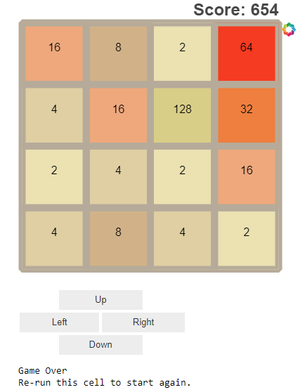

# 2048 in Python with Jupyter notebook
This is a basic attempt to reproduce the popular game 2048 in a Jupyter Notebook. 
It is a practice script in my quest for learning Python (and data science).  

### About the game (from Wikipedia):
2048 was developed by Gabriele Cirulli and was written in JavaScript and CSS. It was released on March 9, 2014 as free
and open-source software subject to the MIT license. It can be found [here](http://2048game.com/). 

The game is played on a 4×4 grid, with numbered tiles that slide when a player moves them using the four arrow keys. 
Every turn, a new tile will randomly appear in an empty spot on the board with a value of either 2 or 4. 
Tiles slide as far as possible in the chosen direction until they are stopped by either another tile or the edge of
the grid. 
If two tiles of the same number collide, they will merge into a tile with the sum of their values. 
The resulting tile cannot merge with another tile again in the same move. 
A scoreboard on the upper-right keeps track of the user's score. 
The user's score starts at zero, and is incremented whenever two tiles combine, by the value of the new tile. 
Traditionally, the game is won when a tile with a value of 2048 appears on the board, but the player can continue to play in order to reach as high a score as possible. Therefore the game ends when the player has no legal moves, ie. there are no empty spaces and no adjacent tiles with the same value on the board.

### Motivation
I chose the Jupyter (Ipython) Notebook to reproduce this game as a challenge to use an environment that is extremely versatile for data science, but unusual to development games on. (Also, I hope it would be playable online, via Binder.) 
I used Bokeh for plotting, and Ipython widgets for interaction. The result is obviously not as sleek as the original, as it lacks the smooth transition of tiles and all the CSS embroidery, and it uses the mouse to click 'action' buttons instead of moving with the arrow keys. Also, there is no   
It is just to showcase the capabilities of the notebook and its widgets, and to avoid having to write any javascript
directly.  
After I finished this little project, I came across [this blog post](https://flothesof.github.io/2048-game.html), which features a cleaner python implementation of the logic part for the same game.

### Usage:
* If using Anaconda, Jupyter comes pre-installed, as well as `bokeh` which I used for visualization. 
* Alternatively, to install dependecies manually:
  * `Jupyter Notebook`
  * `bokeh`
  * the file `grid.py` holds the logic and is included in the imports at the top of the notebook. 
* Fire up the jupyter notebook in the directory where you cloned this repo.
* Open the `play2048` file and run the cells. The game board will be generated at the bottom, inside the notebook.
* Click on the button widgets to play.

Enjoy :)
